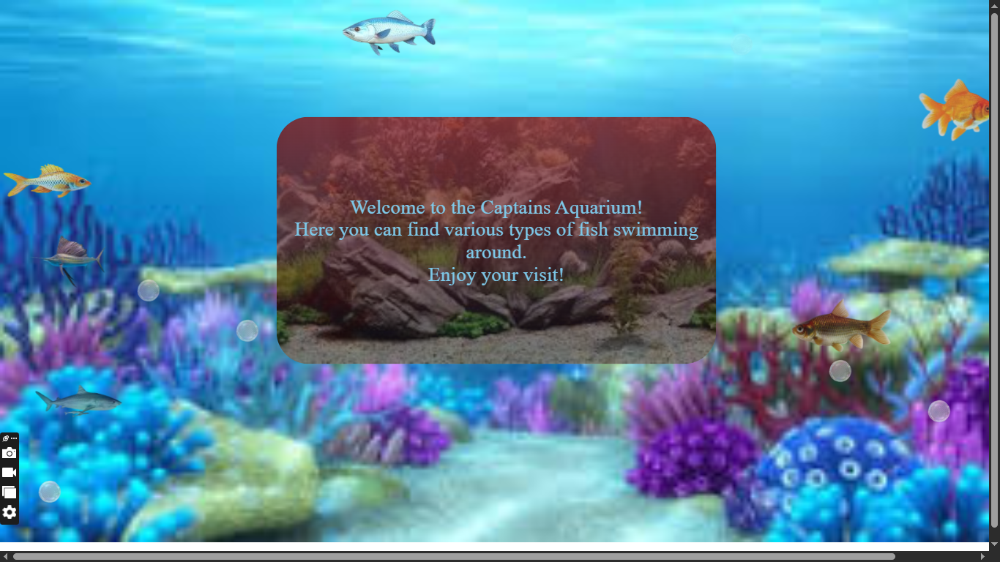

# Aquariumweb
An Home page for an aquarium website, 

Issues:
i think the styles are clashing with each other and alos my whole background page is not covering all the page on smaller devices
A project came up so i decided to leave this although it isnt hard to fix
Feel Free to fix this issues 🎈🔹🔹🔹🔹

<h1>Below is the awuarium website</h1>

The animations allows the fishes and the bubbles to move but apparently fishes image aint even showing also, so best of luck

